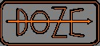

# doze



A minimal, extensible build system for file-based pipelines.

# Overview

`doze` is a simple build system that figures out what needs to run, and in what order, based on the dependencies between your files. You describe rules: a rule takes some input artifacts, produces some output artifacts, and runs a procedure to do it. `doze` creates a DAG from the rules specifications, and traverses that DAG until all the outputs of the rules have been brought up-to-date.

The core is intentionally small. The `doze` library itself only knows about rules, artifacts and dependency resolution. All actual work, such as compiling, copying or linking files is delegated to procedures, which are typed Rust functions compiled into the `doze` CLI to extend its functionalities.

# How it works

A rule declares its inputs and outputs as file tags, plus which procedure is needed to consume the inputs to form the outputs:

```
rule {
    inputs: ["main.c", "header.h"]
    outputs: ["myapp"]
    procedure: "compilers.gcc"
}
```

> [!NOTE]
> The above syntax is completely made-up. `doze` currently does not expose a parsing interface.

Each input and output becomes a node in the dependency graph (or DAG), in `doze` these nodes are called `artifacts`. `doze` links rules together automatically, if one rule's output is another rule's input, so that the graph may reflect that dependency. Given the full set of rules, the resolver computes a valid execution plan where every rule runs only after everything it depends on has already run.
